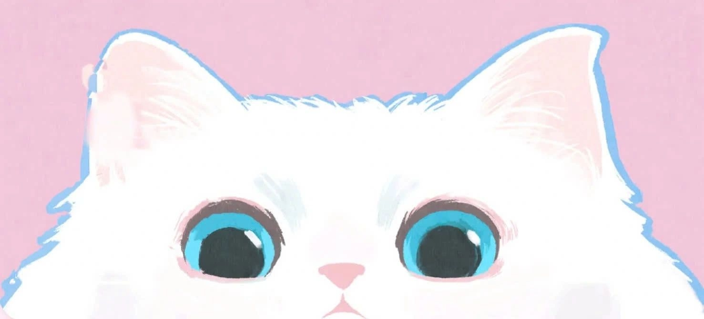

<!-- ✦ Sparkle top strip ✦ -->
&nbsp;&nbsp;
&nbsp;&nbsp;
&nbsp;&nbsp;
&nbsp;&nbsp;

<!-- ✦ Original Banner — kept ✦ -->

<!-- ✦ Typing SVG Intro — kept, now paired with a second sparkle line ✦ -->

<!-- ✦ Original cat + profile views — kept ✦ -->
  

&nbsp;

&nbsp;

<!-- ═══════════════════════════════════════ -->
<!-- ✦ About Me ✦ -->
<!-- ═══════════════════════════════════════ -->

<table>
  <tr>
    <td width="180" align="center">
      <!-- ✦ Original Hello Kitty gif — kept ✦ -->
       
      
      
      
    </td>
    <td>
      

        🌸 &nbsp; hi, i'm a <b>soft-hearted dev</b> who loves pastel aesthetics & clean code 
        💜 &nbsp; currently exploring <b>AI Engineering</b> 
        🎀 &nbsp; believer in <b>beautiful code</b> that feels like home 
        🌙 &nbsp; fueled by matcha lattes & good playlists 
        🦋 &nbsp; she/her &nbsp;|&nbsp; ☁️ dreamer &nbsp;|&nbsp; 🍰 dessert enthusiast  
        
        
      

    </td>
  </tr>
</table>

<!-- ═══════════════════════════════════════ -->
<!-- ✦ Tech Stack ✦ -->
<!-- ═══════════════════════════════════════ -->

<table align="center">
<tr>
<td align="center" width="48%">

#### 🐍 Languages

#### 🚀 Frameworks

#### 🛠️ Tools

</td>
<td width="4%"></td>
<td align="center" width="48%">

#### 🤖 AI / ML

#### 🧠 LLM / RAG

</td>
</tr>
</table>

| 🎯 Core Skills |
|---|
| `Machine Learning` · `Deep Learning` · `Computer Vision` · `NLP` · `Generative AI` |
| `Prompt Engineering` · `RAG Pipelines` · `Vector Databases` · `Embeddings` · `Semantic Search` |
| `FastAPI Deployment` · `Model Inference Pipelines` · `Containerization (Docker)` |

<!-- ═══════════════════════════════════════ -->
<!-- ✦ Featured Projects ✦ -->
<!-- ═══════════════════════════════════════ -->

&nbsp;
<i>a little gallery of things I've poured matcha and midnight hours into</i>&nbsp;

 

<table>
<tr>

<td width="50%" valign="top">

 
AI-Powered Medical Imaging System
 

 

  

🎗️ &nbsp;<b>ResNet-50</b>-powered MRI classification for tumor detection 
⚡ &nbsp;Real-time <b>FastAPI</b> inference pipeline 
🩺 &nbsp;<b>LLM-powered assistant</b> for intelligent patient interaction 
📈 &nbsp;Built for accuracy-first, medically sensitive predictions

 

</td>

<td width="50%" valign="top">

 
AI-Powered Agricultural Assistant
 

 

  

🌾 &nbsp;ML-based <b>eDNA classification</b> pipeline for farm insights 
🧠 &nbsp;<b>RAG architecture</b> powered by Gemini LLM 
🔌 &nbsp;FastAPI backend with a <b>React Native</b> mobile frontend 
🌍 &nbsp;Built to make agricultural data accessible to everyone

 

</td>

</tr>
<tr>

<td width="50%" valign="top">

 
Institutional AI Question & Evaluation System
 

  

  

📚 &nbsp;Automated question paper generation + answer keys 
🔍 &nbsp;<b>RAG + semantic search</b> with automated deduplication 
🏫 &nbsp;Full educational content management workflow 
📦 &nbsp;Fully <b>containerized</b> with Docker for scalable deployment

 

</td>

<td width="50%" valign="top">

 
AI-Powered Resume Generation Platform
 

  

  

🔐 &nbsp;<b>Privacy-first</b> — runs fully offline, nothing leaves your machine 
📊 &nbsp;Auto-analyzes GitHub repos + classifies project domains 
📝 &nbsp;Generates role-specific <b>LaTeX resumes</b> via local LLMs 
💬 &nbsp;Streaming AI chat for resume refinement

 

</td>

</tr>
</table>

<!-- ═══════════════════════════════════════ -->
<!-- ✦ Publications ✦ -->
<!-- ═══════════════════════════════════════ -->

<!-- 

&nbsp;
<i>research & writing I'm proud of</i>&nbsp;

 

<table width="100%">
<tr><td>

🏛️ &nbsp;Published in <b>IJRPR</b> &nbsp;|&nbsp; 📅 &nbsp;2024

</td></tr>
</table>

<table width="100%">
<tr><td> 

🏛️ &nbsp;Published in <b>IJARESM</b> &nbsp;|&nbsp; 📅 &nbsp;2025

</td></tr>
</table>

 -->

<!-- ═══════════════════════════════════════ -->
<!-- ✦ Achievements ✦ -->
<!-- ═══════════════════════════════════════ -->

<!-- 

&nbsp;
<i>little wins & proud moments</i>&nbsp;

 

<table width="100%">
<tr><td>

participant &nbsp;|&nbsp; built under pressure, survived on snacks & adrenaline ✨

</td></tr>
</table>

<table width="100%">
<tr><td>

<table width="100%"><tr><td align="center">

🐍 &nbsp;<b>Python Rush Hour</b> 
🤖 &nbsp;<b>Generative AI Workshop</b> 
🧩 &nbsp;<b>Gen AI Hackathon Support Sessions</b> 

</td></tr></table>

</td></tr>
</table>

 

 -->

<!-- ═══════════════════════════════════════ -->
<!-- ✦ GitHub Stats ✦ -->
<!-- ═══════════════════════════════════════ -->

 

<!--  -->
 

  

  

<!-- ✦ Trophy showcase — new ✦ -->
<!-- 

  

 -->

<!-- ✦ Contribution snake — new animated element ✦ -->

  

<!-- ═══════════════════════════════════════ -->
<!-- ✦ Let's Connect ✦ -->
<!-- ═══════════════════════════════════════ -->

 

  

<!-- ✦ Cute sign-off with animated hearts ✦ -->
&nbsp;&nbsp;
&nbsp;&nbsp;
&nbsp;&nbsp;
&nbsp;&nbsp;

<i>Thanks for scrolling all the way down here : )</i>

